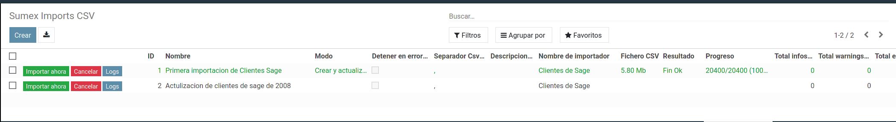
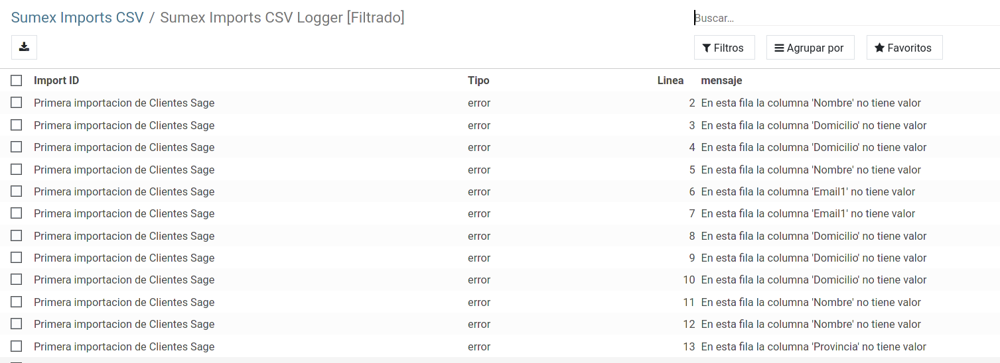

# Módulo Interfaz de importaciones CSV.

Este módulo facilita la importación de ficheros csv con la unica necesidad de implementar los importadores, como si estos fuesen pequeños plugins. 
 

 

Gestiona automáticamente registros logs sobre cada importación para saber que registros no cumplen con los requisitos configurados indicando el motivo y la linea del fichero csv. 

## Añadir un nuevo importador
Para añadir un nuevo importador, en el modelo **sumex_apps_imports_csv** tenemos una lista. 
Esta lista es el tipo de importadores que podremos seleccionar en la interfaz.
En esta lista añadiremos nuestro importador.

<pre>    import_names = [
        ('sumex_apps_imports_csv_import_sage_clientes', 'Clientes de Sage'),
        ('sumex_apps_imports_csv_import_compras_de_sage', 'Pedidos'),
    ]</pre>

_Donde la parte izquierda de cada elemento se refiere al nombre de modelo del importador._
_Donde la parte derecha de cada elemento corresponde al texto descriptivo del importador._  

Acto seguido añadimos un nuevo modelo abstracto en la carpeta _"importadores"
<pre>    class sumex_apps_imports_csv_import_sage_clientes(models.AbstractModel):</pre>

### Definicion de columnas del fichero csv
A continuación añadimos dentro de nuestro nuevo modelo la lista de columnas que contendrá el Csv
Ejemplo:  

<pre>    class sumex_apps_imports_csv_import_sage_clientes(models.AbstractModel):
        fieldnames = [
        ('Nombre', True),    
        ('Provincia', True),
        ('Pais', True),
        ('CifEuropeo', True)
    ]</pre>

Donde fieldnames configura el total de columnas del fichero csv, cuyo formato es (columna_nombre, requerido). 
Las columnas no necesitan un orden específico. 
El importador se encargará de crear un diccionario de nombres de columnas y valores según vaya leyendo cada fila. Y de forma automatica validará la fila por las columnas definidias como obligatorias. 

### Métodos funcionales del importador

En el mismo modelo definiremos 2 métodos: **validate_row()**, **import_row()**  
Ambos métodos tienen como retorno:  

   - return {'info': '....'}  
   - return {'warning': '....'}  
   - return {'error': '....'}  
     Estos notifican los mensajes al log y suman a los contadores de estos mismos. 
     En [validate_row] se require el retorno de "TRUE", de lo contrario no se ejecuta el método [import_row] 
     En los métodos [validate_row] y [import_row] el retorno {'error'} puede detener la importación si la configuración del registro de importación está configurado para que así suceda.  

#### Ejemplo de Método validate_row

<pre>    def validate_row(self, file_csv_content_row):
        # Las validaciones generales de campos requeridos ya se realizan en el modelo de importaciones
        if len(file_csv_content_row['Municipio']) < 5:  # Comprobar que el municipio tiene al menos 5 caracteres
            return {'error': "En esta fila la columna '%s' no contiene un valor válido (se exige al menos 5 caracteres)" % 'Municipio'}
        return</pre>

#### Ejemplo de Método import_row
<pre>    def import_row(self, file_csv_header, file_csv_content_row):  

        # buscar por Nombre y CifEuropeo
        partner_model = self.env['sumex_apps_imports_csv_library'].get_model('res.partner', import_name)
        partner = partner_model.search([
            ('name', '=', file_csv_content_row['Nombre']),
            ('vat', '=', file_csv_content_row['CifEuropeo']),
        ])
        if not partner:
            partner = partner_model.create({
                'name': file_csv_content_row['Nombre'],
                'vat': file_csv_content_row['CifEuropeo'],
                'is_company': True
            })
		else:
            partner.is_company = True
    
        for field in [
            ('Domicilio', 'street'),
            ('Municipio', 'city'),
            ('Telefono', 'phone'),
            ('Telefono2', 'mobile'),
            ('Email1', 'email'),
            ('CodigoPostal', 'zip'),
        ]:
            field_csv = field[0]
            field_odoo = field[1]
            if field_csv in file_csv_content_row and file_csv_content_row[field_csv]:
                setattr(partner, field_odoo, file_csv_content_row[field_csv])        

</pre>